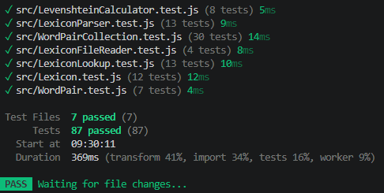

# Test Report

## Summary

I chose to test the module using automated unit tests with Vitest because it makes it so much  easier to run the same tests repeatedly,especially when refactoring a lot, it really helps to have unit tests that can tell you if you broke something on accident, and they were a great help to me during the process. The testing is manily focused on verifying that the different classes work as expected, but I also tested some invalid input, edge cases, and error handling although not as thoroughly as I would have liked. I wrote separate test suites for the different classes so that each part of the module could be tested independently.

I found the `WordPairCollection` class the most difficult to test overall, as it has many methods that work in similar ways, but some operate on the headword while others operate on the counterpart. This sometimes made it confusing to keep track of which part of the `WordPair` each method was supposed to work with or what it returns. It also didn’t help that I struggled a lot with finding clear and suitable names for the methods and ended up trying out different names several times during the process which further added to the confusion.

## Test Run

## Test Results

| What was tested | How it was tested | Result |
| ---------------- | ------------------ | ------- |
| `WordPair` creates a pair with a headword and counterpart | Automated unit test (Vitest): created a `WordPair` and verified the headword and counterpart properties with `toBe()`. | ✅ |
| `WordPair` rejects invalid words | Automated unit tests (Vitest): passed numbers, null, booleans and empty strings as headwords and counterparts and verified that `TypeError` is thrown with `toThrow(TypeError)`. | ✅ |
| `WordPair` trims whitespace and matches words case-insensitively | Automated unit tests (Vitest): created pairs with surrounding whitespace and tested `hasHeadword()` and `hasCounterpart()` using different casing. | ✅ |
| `WordPair.equals()` requires both words to match | Automated unit test (Vitest): compared pairs with matching words using different casing and pairs where either the headword or counterpart differed. Results were verified with `toBe(true)` and `toBe(false)`. | ✅ |
| `WordPairCollection.add()` adds word pairs and prevents duplicates | Automated unit tests (Vitest): added individual pairs, multiple counterparts for the same headword, and duplicate pairs with different casing. Verified the collection size and that duplicates throw an error. | ✅ |
| `WordPairCollection.addMany()` adds and validates multiple pairs | Automated unit tests (Vitest): added arrays of `WordPair` objects and tested invalid arrays, non-`WordPair` items, duplicate pairs and existing pairs. Verified that invalid input throws and that no partial changes are made to the collection. | ✅ |
| `WordPairCollection.remove()` removes the correct pair | Automated unit tests (Vitest): removed existing pairs using different casing and verified that only the matching pair was removed. Also tested that removing a non-existing pair throws an error. | ✅ |
| `WordPairCollection` lookup methods find the correct word pairs | Automated unit tests (Vitest): tested `findCounterparts()`, `findHeadwords()`, `findPairsByHeadword()` and `findPairsByCounterpart()` with matching, missing and differently cased words. | ✅ |
| Collection state and getters work correctly | Automated unit tests (Vitest): tested `allHeadwords`, `allCounterparts`, `allPairs`, `size`, `has()`, `clear()` and iteration with `for...of`. Also verified that `allPairs` returns a copy so the internal collection cannot be modified externally. | ✅ |
| `LexiconParser.parseDelimitedText()` parses delimited text into `WordPair` objects | Automated unit tests (Vitest): called `parseDelimitedText()` with comma- and tab-separated strings, then used `toHaveLength()`, `toBeInstanceOf()` and property assertions with `toBe()` to verify the parsed pairs. | ✅ |
| `parseDelimitedText()` handles invalid and irregular lines | Automated unit tests (Vitest): passed strings containing empty lines, incomplete lines, whitespace-only fields, extra fields and `\r\n` line endings. Verified the resulting array using `toHaveLength()` and `toBe()`, and verified that fields are trimmed. | ✅ |
| `LexiconParser.parseJson()` parses JSON arrays into `WordPair` objects | Automated unit test (Vitest): created JSON input using `JSON.stringify()`, passed configurable `headwordKey` and `counterpartKey` values to `parseJson()`, and verified the resulting objects with `toHaveLength()`, `toBeInstanceOf()` and `toBe()`. | ✅ |
| `parseJson()` validates invalid JSON input and required fields | Automated unit tests (Vitest): tested missing keys, missing properties, empty strings, non-array JSON and invalid JSON. Used `toThrow(TypeError)` and `toThrow(SyntaxError)` to verify the expected errors. | ✅ |
| `readDelimited()` reads a file and parses its content as delimited text | Automated unit test (Vitest): mocked `fs.readFile()` to return CSV content and injected a mocked parser. Verified that the file was read as UTF-8, that the content and delimiter were passed to `parseDelimitedText()`, and that the parsed result was returned. | ✅ |
| `readJson()` reads a file and parses its content as JSON | Automated unit test (Vitest): mocked `fs.readFile()` to return JSON content and injected a mocked parser. Verified that the file content and JSON keys were passed to `parseJson()` and that the parsed result was returned. | ✅ |
| File-system errors are handled correctly | Automated unit tests (Vitest): mocked `fs.readFile()` to reject with an `ENOENT` error and verified that a clear "File not found" error is thrown. Also mocked an `EACCES` error and verified that other file-system errors are rethrown unchanged. | ✅ |
| `LevenshteinCalculator.distance()` validates its input | Automated unit tests (Vitest): called `distance()` with numbers, `null` and `undefined` and verified that each call throws a `TypeError`. | ✅ |
| `LevenshteinCalculator.distance()` handles identical and empty strings | Automated unit tests (Vitest): verified that identical strings return a distance of 0, and that comparing an empty string with a word returns the word's length. | ✅ |
| `LevenshteinCalculator.distance()` correctly counts single-character edits | Automated unit tests (Vitest): tested a substitution (`hus` → `has`) and an insertion (`Haus` → `Hause`), verifying that each has a distance of 1. | ✅ |
| `LevenshteinCalculator.distance()` calculates the edit distance between different words | Automated unit test (Vitest): calculated the distance between the strings `kitten` and `sitting` and verified the result is 3. | ✅ |
| `LevenshteinCalculator.distance()` is symmetric | Automated unit test (Vitest): calculated the distance between `kitten` and `sitting` in both directions and verified that the two results are equal. | ✅ |
| `LexiconLookup` validates the distance calculator provided to its constructor | Automated unit test (Vitest): created `LexiconLookup` with invalid calculator objects (`{}` and `null`) and verified that a `TypeError` is thrown. | ✅ |
| `LexiconLookup` performs case-insensitive exact lookups | Automated unit tests (Vitest): tested `findPairsByHeadword()`, `findPairsByCounterpart()`, `findCounterparts()` and `findHeadwords()` using matching data and differently cased input. Verified that all expected pairs or words were returned. | ✅ |
| `LexiconLookup` returns multiple matching pairs when applicable | Automated unit tests (Vitest): added multiple pairs with the same headword and verified that both associated counterparts were returned by the relevant lookup methods. | ✅ |
| `LexiconLookup` performs case-insensitive fuzzy searches using the maximum distance | Automated unit tests (Vitest): tested `similarHeadword()` and `similarCounterpart()` with misspelled and differently cased input, using `maxDistance = 1`, and verified that the expected pairs were returned. | ✅ |
| `Lexicon` manages word pairs through its basic collection operations | Automated unit tests (Vitest): tested `add()`, `remove()`, `has()`, `size` and `clear()` by adding and removing `WordPair` instances and verifying the collection state after each operation. | ✅ |
| `Lexicon` provides access to its stored word-pair data | Automated unit tests (Vitest): added multiple pairs and verified that `allPairs`, `allHeadwords` and `allCounterparts` return the expected `WordPair` objects and unique words. | ✅ |
| `Lexicon` provides access to `LexiconLookup` | Automated unit test (Vitest): verified that the `lookup` property exposes a lookup object and used `findPairsByHeadword()` to confirm that it operates on the same underlying collection. | ✅ |
| `Lexicon` loads word pairs from files | Automated unit tests (Vitest): mocked `fs.readFile()` with `vi.spyOn()` to provide CSV and JSON content without accessing the real file system. Called `loadFromFile()` and `loadFromJson()` and verified that the files were read as UTF-8 and that the parsed word pairs were added to the lexicon. | ✅ |
